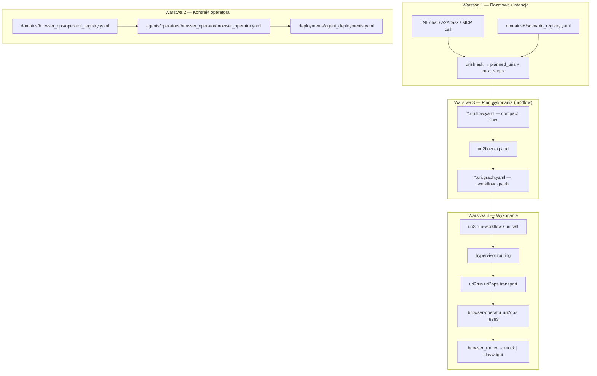
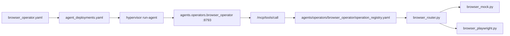

# Od rozmowy agentów do wdrożenia — URI, kontrakt, uri2flow

Jak w kilku zdaniach przejść od **dyskusji dwóch agentów** do **działającego browser-operator** w hypervisorze.

## TL;DR — czy to już mamy?

**Tak, częściowo i warstwowo.** Pełna „rozmowa LLM ↔ LLM” nie jest osobnym protokołem, ale ten sam efekt da się osiągnąć w kilku zdaniach URI:

```text
Agent Planujący:  uri ask "Otwórz stronę testową w browser operator i pokaż DOM"
Agent Wykonawczy: uri call browser://chrome/page/open --payload '{"url":"http://localhost:8788/www/"}' --approve
Hypervisor:       hypervisor run-agent browser-operator.local --detach --wait-healthy
```

Albo jednym **compact flow** (uri2flow):

```yaml
do:
  - hypervisor://local/browser-operator.local/run
  - browser://chrome/page/open:
      url: http://localhost:8788/www/
  - browser://chrome/page/active/dom
```

Potem: `uri2flow expand` → `uri3 run-workflow` → `uri3` normalizuje URI do
`tellmesh://operators/browser/...`, hypervisor wybiera `browser-operator.local`
i środowisko wykonania, a `uri2run` przekazuje wywołanie do **uri2ops**.

---

## Kolejność formatów (od rozmowy do kodu)



| Krok | Format | Schema / plik | Kto wykonuje |
|------|--------|---------------|--------------|
| 1 | **Rozmowa / intencja** | brak osobnego JSON Schema; envelope `urish ask` + `domains/browser_ops/scenario_registry.yaml` | Planujący agent (NL → URI) |
| 2 | **Kontrakt operatora** | `kind: hypervisor.operator_agent` w YAML | Hypervisor (lifecycle) |
| 3 | **Compact flow** | [`tellmesh/uri2flow` flow format](https://github.com/tellmesh/uri2flow/blob/main/docs/FLOW_FORMAT.md) | Człowiek / LLM autor |
| 4 | **Workflow graph** | `schemas/workflow_graph.schema.json` | `uri2flow expand` |
| 5 | **Task operatora** | installed `uri2ops/schemas/operator_task.schema.json` | uri2ops (mock/playwright) |

**Kolejność jest zawsze:** rozmowa/intencja → kontrakt (co agent *może*) → uri2flow (co *zrobić*) → graph (maszyna) → uri2ops (wykonanie).

---

## Przykład: rozmowa dwóch agentów (browser-operator)

### Agent A — Planujący (Planner)

Rola: tłumaczy NL na plan URI, **nie wykonuje** mutacji.

```text
[Planner]
Użytkownik chce sprawdzić WWW TellMesh w Chrome operatorze.

Proponuję:
  1. health://agent/browser-operator.local
  2. browser://chrome/page/open  url=http://localhost:8788/www/
  3. browser://chrome/page/active/dom

Następne kroki CLI:
  hypervisor run-agent browser-operator.local --detach --wait-healthy
  uri call browser://chrome/page/open --payload '{"url":"http://localhost:8788/www/"}' --approve --adapter mock
```

W repo odpowiada to:

```bash
uri ask "Otwórz stronę testową w browser operator i pobierz DOM"
```

Envelope (uproszczony):

```yaml
ok: true
data:
  detected_kind: browser_ops
  detected_subtype: browser_capture
  planned_uris:
    - browser://chrome/page/open
    - browser://chrome/page/active/dom
    - browser://chrome/page/active/screenshot
  next_steps:
    - hypervisor inspect-agent browser-operator.local
    - uri2ops run examples/10_browser_operator/task.health.yaml --adapter auto --approve
```

Źródło reguł: [`domains/browser_ops/scenario_registry.yaml`](../domains/browser_ops/scenario_registry.yaml)  
Implementacja ask: `urish.backends.ask` from [`tellmesh/urish`](https://github.com/tellmesh/urish)

### Agent B — Wykonawczy (Operator Executor)

Rola: przyjmuje **URI / MCP / A2A**, egzekwuje przez uri2ops.

```text
[Operator @ browser-operator.local:8793]
Otrzymałem: browser://chrome/page/open
Payload: { "url": "http://localhost:8788/www/", "adapter": "mock", "approve": true }
Wynik: { "ok": true, "title": "TellMesh", "adapter": "mock" }
```

HTTP (MCP):

```bash
curl -X POST 'http://127.0.0.1:8793/mcp/tools/call?render=markdown' \
  -H 'Content-Type: application/json' \
  -d '{
    "name": "browser_open",
    "arguments": {
      "approve": true,
      "environment": "local",
      "payload": { "url": "http://localhost:8788/www/", "adapter": "mock" }
    }
  }'
```

To nie jest osobny „dialog protocol” — to **A2A/MCP task** na już uruchomionym operatorze.

---

## Schema 1 — Rozmowa / intencja

Nie ma jednego pliku `conversation.schema.json`. Intencja jest opisana deklaratywnie:

```yaml
# domains/browser_ops/scenario_registry.yaml (fragment)
kind: urish.scenario_registry
intent_kind: browser_ops
default_deployment_id: browser-operator.local
scenarios:
  - id: browser_operator_capture
    chat_prompt: Otworz strone testowa w chrome operator i pobierz DOM oraz obraz.
    planned_uris:
      - browser://chrome/page/open
      - browser://chrome/page/active/dom
      - browser://chrome/page/active/screenshot
    human_in_the_loop: true
```

Chat UI (`www/chat.html`) woła `POST /api/ask` → `urish ask` — patrz [`docs/CHAT_AND_WORKFLOWS.md`](./CHAT_AND_WORKFLOWS.md).

---

## Schema 2 — Kontrakt operatora

Plik: [`agents/operators/browser_operator/browser_operator.yaml`](../agents/operators/browser_operator/browser_operator.yaml)

```yaml
version: 1
kind: hypervisor.operator_agent
metadata:
  id: browser-operator
  agent_ref: agent://browser-operator
runtime:
  command: uvicorn agents.operators.browser_operator.main:app --host 127.0.0.1 --port 8793
  deployment_id: browser-operator.local
  health_uri: http://127.0.0.1:8793/health
  mcp_call_uri: http://127.0.0.1:8793/mcp/tools/call
capabilities:
  - scheme: browser
    operations: [open, extract_dom, screenshot, click]
    adapters: [mock, playwright, auto]
contracts:
  domain_pack: domains/browser_ops/domain.yaml
  operation_registry: agents/operators/browser_operator/operation_registry.yaml
```

Powiązane pliki:

| Plik | Rola |
|------|------|
| [`deployments/agent_deployments.yaml`](../deployments/agent_deployments.yaml) | port 8793, env `URI2OPS_BASE_URL` |
| [`domains/browser_ops/operator_registry.yaml`](../domains/browser_ops/operator_registry.yaml) | karty operacji URI |
| [`domains/browser_ops/domain.yaml`](../domains/browser_ops/domain.yaml) | granica domeny (routing, nie wykonanie) |
| [`config/runtime_environments.yaml`](../config/runtime_environments.yaml) | profile `local` / `docker` / `mock` / `remote` |

---

## Schema 3 — Compact uri2flow

Plik przykładowy (do utworzenia / skopiowania):

```yaml
# examples/browser_ops/capture_www.uri.flow.yaml
flow:
  id: browser-capture-tellmesh-www
  description: Uruchom browser-operator, otwórz WWW TellMesh, pobierz DOM.

do:
  - hypervisor://local/browser-operator.local/run
  - health://agent/browser-operator.local
  - browser://chrome/page/open:
      url: http://localhost:8788/www/
  - browser://chrome/page/active/dom
  - browser://chrome/page/active/screenshot
```

Specyfikacja: [`tellmesh/uri2flow` flow format](https://github.com/tellmesh/uri2flow/blob/main/docs/FLOW_FORMAT.md)

Po expand (`uri2flow expand …`) powstaje **workflow_graph**:

```yaml
graph:
  id: browser-capture-tellmesh-www
  kind: workflow
  nodes:
    - id: hypervisor-local-browser-operator-local-run
      uri: hypervisor://local/browser-operator.local/run
      operation: run
      kind: command
    - id: browser-chrome-page-open
      uri: browser://chrome/page/open
      operation: open
      kind: command
      payload:
        url: http://localhost:8788/www/
      depends_on: [hypervisor-local-browser-operator-local-run]
      requires_approval: true
  edges:
    - from: hypervisor-local-browser-operator-local-run
      to: browser-chrome-page-open
      type: depends_on
```

Schema graphu: [`schemas/workflow_graph.schema.json`](../schemas/workflow_graph.schema.json)

---

## Gdzie jest zaimplementowany `browser_operator.yaml`?



| Warstwa | Ścieżka |
|---------|---------|
| Kontrakt YAML | [`agents/operators/browser_operator/browser_operator.yaml`](../agents/operators/browser_operator/browser_operator.yaml) |
| Deployment | [`deployments/agent_deployments.yaml`](../deployments/agent_deployments.yaml) (`browser-operator.local`) |
| Hypervisor lifecycle | [`packages/resource-agent-hypervisor/hypervisor/`](../packages/resource-agent-hypervisor/hypervisor/) |
| Agent entry | [`agents/operators/browser_operator/main.py`](../agents/operators/browser_operator/main.py) |
| HTTP daemon (framework) | `uri2ops.server.app` from [`tellmesh/uri2ops`](https://github.com/tellmesh/uri2ops) |
| MCP browser_open | `uri2ops.server.routes.mcp` from [`tellmesh/uri2ops`](https://github.com/tellmesh/uri2ops) |
| Rejestr operacji | [`agents/operators/browser_operator/operation_registry.yaml`](../agents/operators/browser_operator/operation_registry.yaml) |
| Router adapterów | [`agents/operators/browser_operator/adapters/browser_router.py`](../agents/operators/browser_operator/adapters/browser_router.py) |
| Mock / Playwright | `browser_mock.py`, `browser_playwright.py` |
| Policy (approve) | `urish.policy` and `hypervisor.routing.policy` |
| NL → plan URI | [`domains/browser_ops/scenario_registry.yaml`](../domains/browser_ops/scenario_registry.yaml) |

Fragment rejestru operacji:

```yaml
# agents/operators/browser_operator/operation_registry.yaml
browser:
  open:
    handler: python://agents.operators.browser_operator.adapters.browser_router:open_page
    adapters: [mock, playwright, auto]
```

---

## Krok po kroku — od zera do działającego flow

### 1. Rozmowa → plan (bez wykonania)

```bash
uri ask "Sprawdź browser operator i otwórz stronę testową TellMesh"
# → planned_uris + next_steps (dry-run domyślnie)
```

### 2. Uruchom operatora (kontrakt → proces)

```bash
hypervisor run-agent browser-operator.local --detach --wait-healthy
uri call health://agent/browser-operator.local
```

### 3. Pojedyncze URI (najszybsza ścieżka)

```bash
uri call browser://chrome/page/open \
  --payload '{"url":"http://localhost:8788/www/"}' \
  --adapter mock --approve
```

### 4. Compact flow → graph → workflow (CI / powtarzalność)

```bash
uri2flow validate examples/22_dashboard_agent/dashboard_open.uri.flow.yaml
uri2flow expand examples/22_dashboard_agent/dashboard_open.uri.flow.yaml \
  --out output/dashboard-open.uri.graph.yaml
uri3 validate-workflow output/dashboard-open.uri.graph.yaml
uri3 run-workflow output/dashboard-open.uri.graph.yaml --dry-run --browser mock
uri3 run-workflow output/dashboard-open.uri.graph.yaml --approve --browser mock
```

### 5. Task YAML (uri2ops native)

```bash
uri2ops run examples/10_browser_operator/task.health.yaml --adapter mock --approve
```

---

## Co jest gotowe, a czego brakuje

| Element | Status |
|---------|--------|
| NL → planned URIs (`uri ask`) | ✅ |
| Kontrakt operatora YAML | ✅ `browser_operator.yaml` |
| Deployment + declared port 8793 | ✅ |
| MCP/A2A na uri2ops | ✅ |
| Compact flow → graph (`uri2flow`) | ✅ |
| Graph → run (`uri3 run-workflow`) | ✅ |
| Osobny schema „rozmowy dwóch LLM” | ⚠️ brak — jest scenario_registry + ask envelope |
| Automatyczny orchestrator A↔B bez człowieka | ⚠️ częściowo (plan/run w chat, brak pełnego multi-agent dialogu) |
| Jeden prompt → auto-deploy nowego resource-agenta | ✅ `uri agent generate` (inna ścieżka niż ręcznie utrzymywane capability-agenty operatorów) |

---

## Minimalny scenariusz „kilka zdań”

```text
Planner:     "Potrzebuję screenshot strony TellMesh przez browser operator."
             → uri ask → browser://… planned

Human:       klika Run plan (approve) w chat lub:

Operator:    uri call browser://chrome/page/active/screenshot --approve
             → uri3 semantic route → hypervisor.routing → uri2run → browser-operator :8793 → playwright/mock → artifact

Audyt:       view://process/agent/browser-operator.local/latest
```

To jest **zaimplementowany** pipeline. Różnica między „dwoma agentami w rozmowie” a „jednym użytkownikiem + URI” to głównie **warstwa prezentacji** — pod spodem te same formaty: scenario_registry → uri2flow → workflow_graph → uri2ops.

### Alternatywny UI: Flow Chat

TellMesh **NL Chat** (`www/chat.html`) pokazuje wynik jako markdown + JSON envelope.

**Flow Chat** (`www/flow-chat.html`) pokazuje tę samą sesję jako:
- tory **Planner** / **Executor**
- pipeline URI (węzły + strzałki)
- generowany **compact uri2flow** YAML

```bash
# po uruchomieniu WWW (make start lub urish www serve)
open http://localhost:8788/www/flow-chat.html
```

Przycisk **Load demo session** ładuje przykład z trzech linii NL (weather · invoices · screenshot workflow).


- [`tellmesh/uri2flow`](https://github.com/tellmesh/uri2flow)
- [`tellmesh/uri2flow` flow format](https://github.com/tellmesh/uri2flow/blob/main/docs/FLOW_FORMAT.md)
- [`docs/URI2FLOW.md`](./URI2FLOW.md)
- [`docs/CHAT_AND_WORKFLOWS.md`](./CHAT_AND_WORKFLOWS.md)
- [`docs/DOMAIN_SEPARATION.md`](./DOMAIN_SEPARATION.md)
- [`domains/browser_ops/README.md`](../domains/browser_ops/README.md)
- [`market/STANDARDS.md`](../market/STANDARDS.md) — MCP, A2A, agent://
